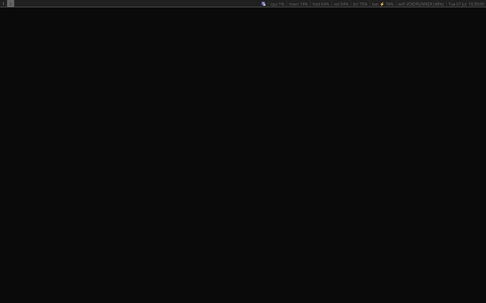
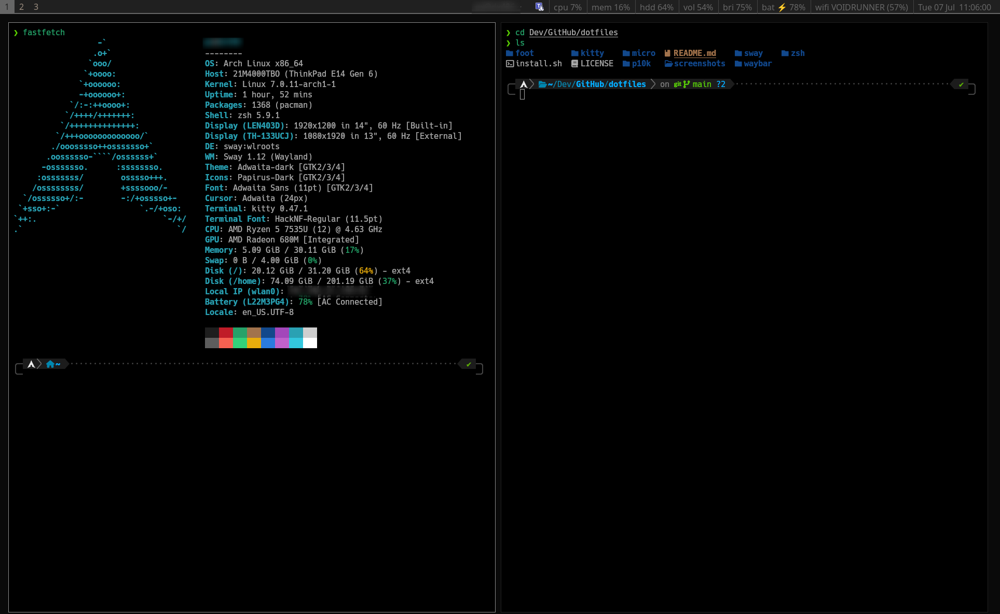
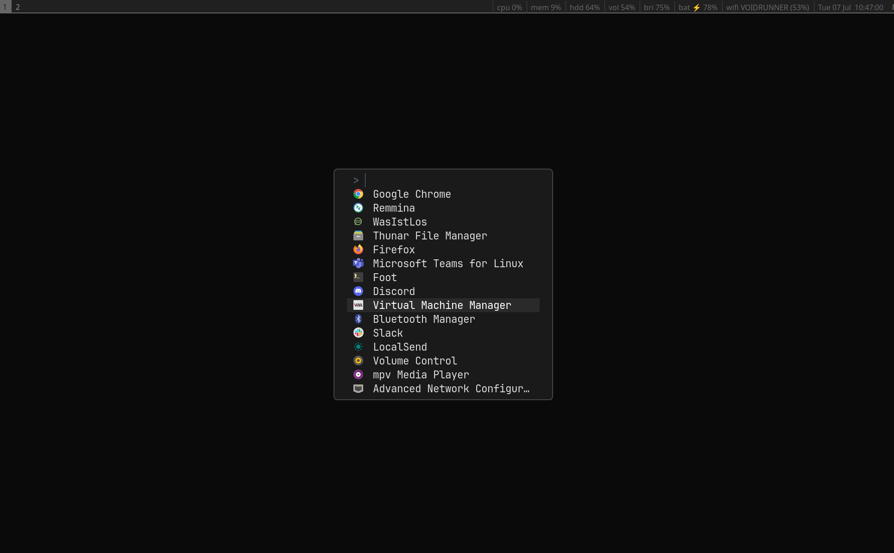

````markdown
# My Linux Dotfiles

A curated collection of my personal Linux configuration files focused on **productivity**, **development**, and **cybersecurity**.

This repository contains the configuration files I use daily for a clean, lightweight, and keyboard-driven workflow powered by **SwayWM**.

---

## 📸 Screenshots

### Desktop



### Terminal (Foot)



### Launcher



---

## ✨ Features

- Minimal and clean desktop environment
- Keyboard-driven workflow
- Lightweight and fast
- Developer-friendly terminal configuration
- Modern shell powered by Zsh + Powerlevel10k
- Wayland-native setup
- Easy to customize
- Version-controlled configuration files

---

## 🛠 Applications

| Application | Description |
|-------------|-------------|
| **Sway** | Wayland compositor |
| **Waybar** | Status bar |
| **Foot** | Primary terminal emulator |
| **Kitty** | GPU-accelerated terminal emulator |
| **Micro** | Terminal-based text editor |
| **Zsh** | Interactive shell |
| **Powerlevel10k** | Zsh prompt theme |

---

## 📂 Repository Structure

```text
.
├── foot/
├── kitty/
├── micro/
├── p10k/
├── screenshots/
│   ├── desktop.png
│   ├── terminal.png
│   └── launcher.png
├── sway/
├── waybar/
├── zsh/
├── install.sh
├── LICENSE
└── README.md
```

---

## 🚀 Installation

Clone the repository:

```bash
git clone https://github.com/0xSECsh/dotfiles.git
cd dotfiles
```

Copy the configuration files:

```bash
cp sway/config ~/.config/sway/

cp waybar/config.jsonc ~/.config/waybar/
cp waybar/style.css ~/.config/waybar/

cp foot/foot.ini ~/.config/foot/

cp kitty/kitty.conf ~/.config/kitty/

cp micro/settings.json ~/.config/micro/
cp micro/bindings.json ~/.config/micro/

cp zsh/.zshrc ~/
cp p10k/.p10k.zsh ~/
```

Restart your shell or log out and back in.

---

## 📦 Dependencies

Recommended packages:

- Sway
- Waybar
- Foot
- Kitty
- Micro
- Zsh
- Git
- Powerlevel10k
- Nerd Fonts

---

## 🎨 Font

For the best experience, install a Nerd Font.

Recommended fonts:

- MesloLGS NF
- JetBrainsMono Nerd Font
- FiraCode Nerd Font

---

## ⚙️ Customization

Feel free to adapt these configurations to your own workflow.

This repository is continuously updated as I improve my Linux development environment.

---

## 📄 License

This project is licensed under the MIT License.
````
